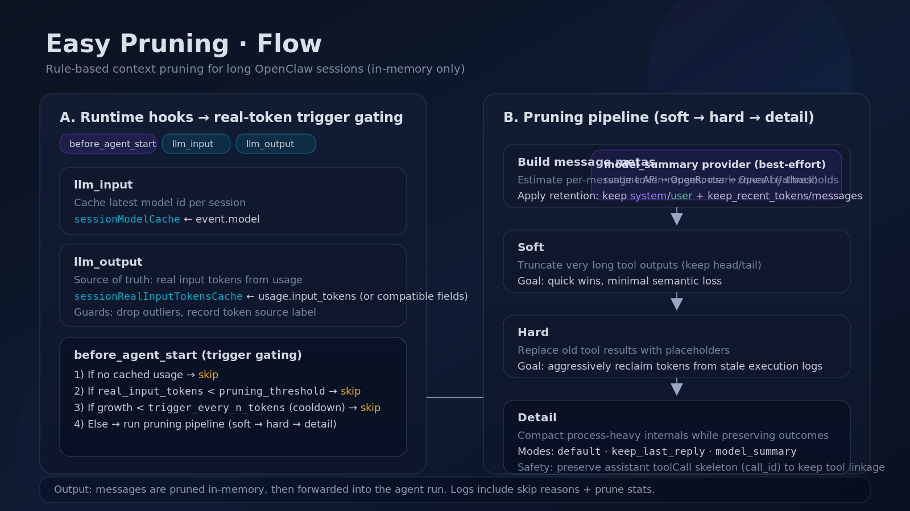

# OpenClaw Easy Pruning Plugin

<p align="left">
  
  
  
</p>

Rule-based, model-agnostic **session context pruning** for OpenClaw.

Easy Pruning trims oversized context **in memory only** before an agent run. It never rewrites your on-disk `*.jsonl` history.



> **Compatibility note:** OpenClaw’s built-in pruning is commonly *Claude-first* (and in many setups effectively Claude-only). Easy Pruning is designed to work across **all models/providers** by using real `llm_output` usage tokens when available, and falling back to a deterministic token estimate when they are not.

---

## Why this project exists

Long-running, tool-heavy OpenClaw sessions often fail for practical reasons:

- Context windows fill up with old tool output long before the conversation is actually “done”
- Critical user/system intent gets diluted by noisy historical execution details
- Recovering from `context_length_exceeded` mid-workflow is painful
- Generic pruning modes are not always sufficient for workflow-specific needs

Easy Pruning solves this with a predictable, plugin-first approach:

- **No core patching**: safer upgrades, lower maintenance risk
- **Model-agnostic**: works across providers/models
- **Rule-based and inspectable**: deterministic behavior, easy to reason about
- **Safety-first retention**: preserve `system` / `user` + recent context first
- **Operational visibility**: pruning decisions are visible in logs

---

## What changed in v0.3.6

v0.3.6 simplifies trigger control and relies on runtime hooks:

- `llm_output`: caches real input token usage per session (source of truth)
- `llm_input`: caches latest model id per session (for logging / model_summary)
- `before_agent_start`: decides whether to prune based on cached real usage

Trigger knobs are now minimal and explicit:

- `pruning_threshold`
- `trigger_every_n_tokens`

---

## How it works (high level)

### Trigger gating

Before each agent run:

1. Prefer real `input_tokens` cached from `llm_output` (usage)
2. If usage is missing, fall back to an **estimated** token count from the current message list
3. If `< pruning_threshold` → skip
4. If growth since last trigger `< trigger_every_n_tokens` → skip
5. Otherwise run the pruning pipeline

### Three-stage pruning pipeline

Pruning applies to messages that are eligible (after retention rules):

- **Soft**: truncate long tool outputs (keep head/tail)
- **Hard**: replace old tool outputs with a placeholder
- **Detail**: drop process-heavy internals while keeping user-facing outcomes

### Retention rules (safety)

Easy Pruning always preserves:

- All `system` messages
- All `user` messages
- The most recent `keep_recent_tokens`
- The most recent `keep_recent_messages`

Thresholds (`soft_threshold` / `hard_threshold` / `detail_threshold`) support:

- ratio (`< 1`) — percentage of current context
- absolute token position (`>= 1`) — token position from context start

---

## Detail pruning modes

`detail_pruning_mode` controls how “detail zone” messages are compacted:

- `default`: heuristic pruning (placeholders / compaction)
- `keep_last_reply`: preserve the last assistant reply when tool calls exist
- `model_summary`: replace pruned detail blocks with short summaries generated by a model

### model_summary provider selection

In `model_summary` mode, Easy Pruning will try (best-effort):

1. OpenClaw runtime model APIs (if exposed by the host runtime)
2. Direct OpenRouter Chat Completions (requires an OpenRouter key)
3. Direct OpenAI Responses API (requires `OPENAI_API_KEY`)

Keys are **never stored** by this plugin. For OpenRouter it can read:

- `OPENROUTER_API_KEY`, or
- OpenClaw `auth-profiles.json` (common runtime locations)

### Tool-call safety

Assistant `toolCall` blocks must remain linkable via `call_id`/`id`.
Easy Pruning preserves the toolCall skeleton even when the text content is summarized or empty.

---

## Install

### Option A: use as a local plugin (recommended)

```bash
git clone <this-repo-url>
cd easy-pruning-plugin
npm install
npm run build
```

### Option B: install from npm

If you publish this package to npm, you can use:

```bash
npm install easy-pruning
```

Then point OpenClaw plugin load path to your `node_modules/easy-pruning` folder.

---

## OpenClaw config example

```json
{
  "plugins": {
    "load": {
      "paths": ["<path-to-easy-pruning-plugin>"]
    },
    "entries": {
      "easy-pruning": {
        "enabled": true,
        "config": {
          "pruning_threshold": 80000,
          "trigger_every_n_tokens": 6000,

          "keep_recent_tokens": 20000,
          "keep_recent_messages": 12,

          "soft_threshold": 0.7,
          "hard_threshold": 0.85,
          "detail_threshold": 0.95,

          "detail_pruning_mode": "model_summary",
          "detail_summary_model": "openrouter/stepfun/step-3.5-flash:free",
          "detail_summary_max_chars": 600,
          "detail_summary_timeout_ms": 12000,
          "pruning_timeout_ms": 20000,

          "debug_pruning_io": false,
          "debug_summary_io": false,
          "debug_log_file": "<optional-log-path>"
        }
      }
    }
  }
}
```

### Recommended minimal config (trigger only)

```json
{
  "pruning_threshold": 80000,
  "trigger_every_n_tokens": 6000
}
```

---

## Observability

Typical logs:

```text
[EasyPruning][Gateway] usage_update session=... model=... real_input_tokens=... source=usage.input_tokens
[EasyPruning][Gateway] session=... model=... real_input_tokens=... source=... threshold=... triggerEvery=...
[EasyPruning][Gateway] skip session=... reason=below_threshold ...
[EasyPruning][Gateway] skip session=... reason=cooldown ...
[EasyPruning][Gateway] prune#... before=... after=... deleted=... changed=...
```

---

## Development

```bash
npm run clean
npm run build
npm test
npm pack --dry-run
```

Optional helper scripts:

- `npm run verify` (local environment checks; may require OpenClaw auth store)
- `npm run verify:live` (calls OpenRouter; may consume credits)
- `npm run monitor` (tail/parse pruning logs)

---

## Security notes

- This repo should not contain API keys.
- The plugin never prints keys to logs.
- Any external API calls in `model_summary` are best-effort and can be disabled by using `detail_pruning_mode != "model_summary"`.

---

## License

MIT
